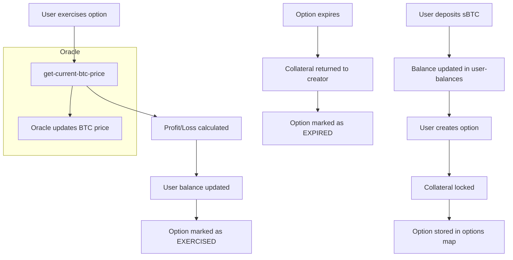

# 📈 BitOptionX - Bitcoin-Powered Options Protocol

**BitOptionX** is a decentralized, non-custodial options trading protocol built on the **Stacks blockchain** and secured by **Bitcoin**. It enables trustless trading of **CALL** and **PUT** options using **sBTC** as collateral, powered by an oracle-based BTC pricing mechanism.

---

## 🧠 System Overview

BitOptionX offers a secure and transparent platform for creating and trading Bitcoin options directly on-chain. It is designed for DeFi users and Bitcoin holders seeking leveraged market exposure or hedging strategies without intermediaries.

### Key Features

* ⚖️ **Trustless CALL/PUT Options** on BTC
* 📡 **Oracle-integrated** BTC pricing and expiry validation
* 🔐 **sBTC-collateralized** settlement and risk mitigation
* ⚙️ **Custom protocol configuration** (fees, validity, collateral ratio)
* 🧾 **On-chain tracking** of option lifecycle (creation, exercise, expiry)

---

## 🏗️ Contract Architecture

The contract is modular, with clearly separated responsibilities:

### 🔧 Configuration & Constants

Defines system limits, fees, collateral ratios, and valid parameter ranges:

* `MAX_FEE_BASIS_POINTS`, `MIN_DEPOSIT_AMOUNT`, `MAX_COLLATERAL_RATIO`
* Platform fee (default `0.1%`) and min collateral ratio (default `150%`)

### 🧾 Core Storage & Data Maps

* `options`: Main option contract registry
* `user-balances`: Tracks each user's sBTC and locked collateral
* `oracle-address`, `btc-price`, `price-validity-window`: Oracle configuration and price data

### 📡 Oracle Functions

* `update-btc-price`: Oracle-only, updates BTC/USD price
* `get-current-btc-price`: Ensures price is fresh (within `validity-window`)
* `set-oracle-address`, `set-price-validity-window`: Admin-controlled parameters

### 💰 User Functions

* `deposit-sbtc`: Deposits sBTC into the user’s protocol balance
* `create-option`: Initializes a new CALL/PUT option with collateral lock
* `exercise-option`: Executes in-the-money options for profit
* `expire-option`: Returns collateral after expiry for unexercised options

### 🛡️ Admin Functions

* `set-platform-fee`, `set-min-collateral-ratio`: Risk and revenue tuning
* `is-contract-owner`: Internal permission check for privileged actions

---

## 🔄 Data Flow Summary

---

## 🛠️ Contract Functions Overview

| Category        | Function                                             | Description                                     |
| --------------- | ---------------------------------------------------- | ----------------------------------------------- |
| **Deposit**     | `deposit-sbtc`                                       | Deposit sBTC for option creation                |
| **Option Mgmt** | `create-option`                                      | Create a new CALL or PUT option                 |
|                 | `exercise-option`                                    | Execute profitable option                       |
|                 | `expire-option`                                      | Expire unexercised option and unlock collateral |
| **Oracle**      | `update-btc-price`                                   | Oracle updates BTC price                        |
|                 | `get-current-btc-price`                              | Retrieve validated BTC price                    |
| **Admin**       | `set-platform-fee`                                   | Set fee in basis points                         |
|                 | `set-oracle-address`                                 | Update oracle principal                         |
|                 | `set-min-collateral-ratio`                           | Adjust required collateralization               |
| **Read-only**   | `get-option`, `get-user-balance`, `get-platform-fee` | View option and user info                       |

---

## 🔐 Security & Validation

BitOptionX is designed with strong guardrails:

* ✅ Validates oracle price freshness before execution
* ✅ Enforces expiry and strike price logic
* ✅ Checks for sufficient collateral at creation
* ✅ Prevents unauthorized access and state manipulation

---

## 🔮 Future Enhancements

* 📊 Secondary market for options (order book or AMM)
* 🏦 sBTC liquidity pooling and reward incentives
* 🔁 Option transfer/sale capabilities
* 📉 Implied volatility-based pricing tools

---

## 📜 License

MIT License © BitOptionX Contributors
